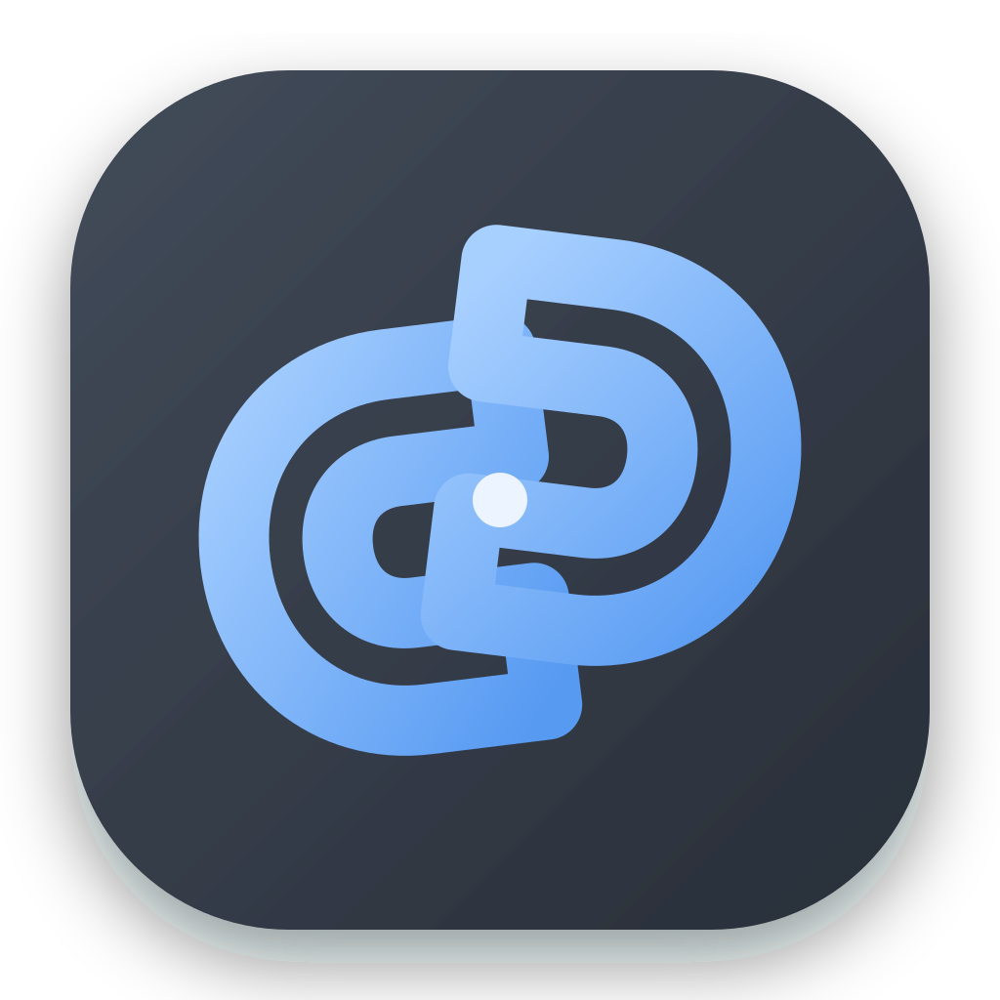
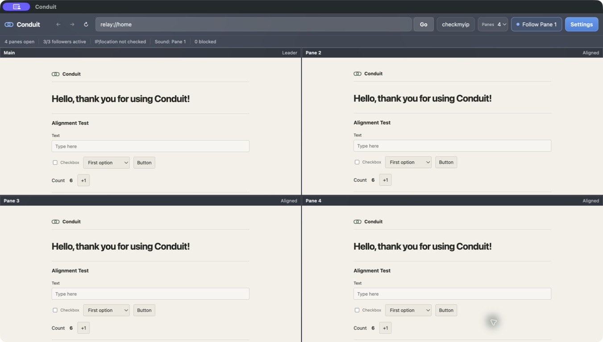
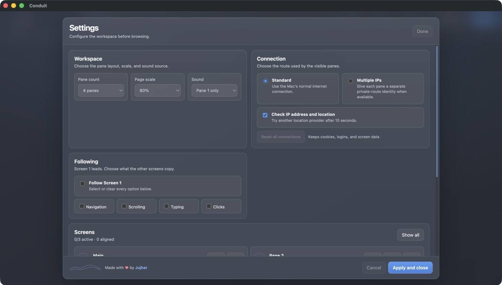

<p align="center">
  
</p>

<h1 align="center">Conduit v3.1</h1>

<p align="center">
A multi-session browser that lets users control multiple isolated browser instances from a single interface.

</p>

<p align="center">
  <a href="https://github.com/jujharaujla/conduit/actions/workflows/ci.yml"></a>
  <a href="https://github.com/jujharaujla/conduit/releases"></a>
  <a href="LICENSE"></a>
</p>

Conduit opens one to four separate browser screens in one desktop window. The control screen can share navigation, scrolling, typing, and ordinary clicks while each other screen keeps its own cookies, storage, cache, and internet connection.

It is intended for authorized website QA, session testing, localization checks, demonstrations, and repeatable multi-session browsing.

> [!IMPORTANT]
> Conduit 3.1 is unsigned. It is not an anonymity guarantee, an anti-detection tool, or a replacement for a dedicated privacy browser. Only use it with websites, accounts, and proxy services you are authorized to access.

<p align="center">
  
</p>

## Download

The current release is **Conduit 3.1.0 unstable** (`v3.1.0`). It is intended for real-world testing and is not a stability or anonymity guarantee.

| Platform | Download |
| --- | --- |
| Windows x64 installer | `Conduit-3.1.0-windows-x64-setup.exe` |
| Windows x64 portable | `Conduit-3.1.0-windows-x64-portable.exe` |
| macOS Apple silicon | `Conduit-3.1.0-mac-arm64.dmg` or `.zip` |
| macOS Intel | `Conduit-3.1.0-mac-x64.dmg` or `.zip` |
| Checksums | `SHA256SUMS.txt` |

### Unsigned-build warning

The release artifacts are not code signed or notarized. Windows SmartScreen and macOS Gatekeeper may warn before launch. Verify the file against `SHA256SUMS.txt`, download only from this repository, and do not bypass a warning for a file from another source.

## Connection modes

### Direct

Uses the computer's normal internet route. A device-wide VPN can be active, but all screens will normally share that VPN route.

### Private routing with Tor

Uses a locally running Tor SOCKS service and gives each screen a distinct SOCKS authentication identity. Conduit detects common Tor ports `9050` and `9150`. Separate identities request separate Tor circuits, but distinct exit addresses are not guaranteed.

<p align="center">
  
</p>

## How it connects

Conduit is an Electron desktop application. The same JavaScript application is packaged as native installers for macOS and Windows, with Electron providing the Chromium browser engine and desktop integration.

Private routing uses a local bridge between each Electron browser session and a Tor SOCKS service. Conceptually, this is similar to running a request with cURL through a SOCKS proxy:

```bash
curl --proxy socks5h://127.0.0.1:9050 https://example.com
```

Conduit configures this route for each browser session instead of asking users to run cURL commands. Direct mode removes that proxy route and uses the computer's normal connection. Private routing requires a compatible local Tor SOCKS service.

## Run from source

Requirements:

- Node.js 22 or newer.
- npm 10 or newer.
- macOS, Windows, or Linux.
- Optional Tor service for private routing.

```bash
npm ci
npm run check
npm start
```

For Tor on macOS:

```bash
brew install tor
brew services start tor
```

## Build desktop installers

Build on the target operating system:

```bash
# macOS DMG and ZIP
npm run dist:mac

# Windows installer and portable EXE
npm run dist:win

# Unpacked development build
npm run pack
```

Installers are written to `dist/`. The GitHub workflow builds Windows x64, macOS arm64, and macOS x64 separately.

## License

Conduit is released under the [MIT License](LICENSE).
